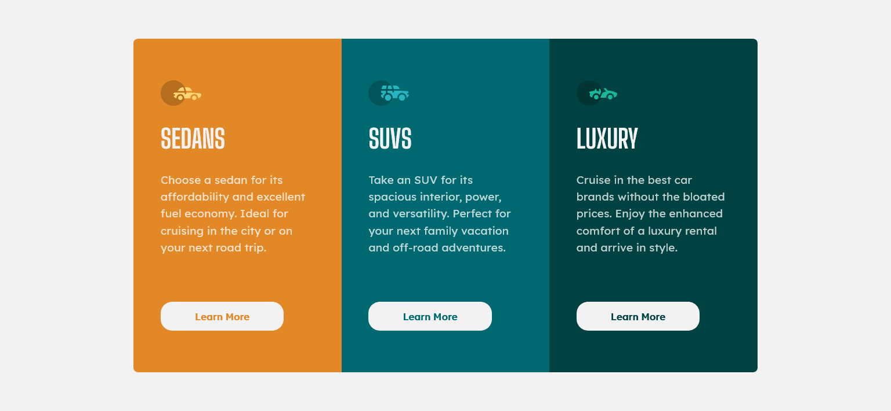

# Frontend Mentor - 3-column preview card component solution

This is a solution to the [3-column preview card component challenge on Frontend Mentor](https://www.frontendmentor.io/challenges/3column-preview-card-component-pH92eAR2-). Frontend Mentor challenges help you improve your coding skills by building realistic projects. 

## Table of contents

- [The challenge](#the-challenge)
- [Screenshot](#screenshot)
- [Links](#links)
- [Built with](#built-with)
- [Author](#author)

### The challenge

Users should be able to:

- View the optimal layout depending on their device's screen size
- See hover states for interactive elements

### Screenshot

### Links

- Solution URL: [https://www.frontendmentor.io/solutions/responsive-3-column-layout-webpage-html5css3flexbox-and-grid-9-xpKwwCA](https://www.frontendmentor.io/solutions/responsive-3-column-layout-webpage-html5css3flexbox-and-grid-9-xpKwwCA)
- Live Site URL: [https://ganbnuray.github.io/3-column-preview-card-component-main/](https://ganbnuray.github.io/3-column-preview-card-component-main/)

### Built with

- Semantic HTML5 markup
- CSS custom properties
- Flexbox
- CSS Grid

## Author

- Frontend Mentor - [@ganbnuray](https://www.frontendmentor.io/profile/ganbnuray)

